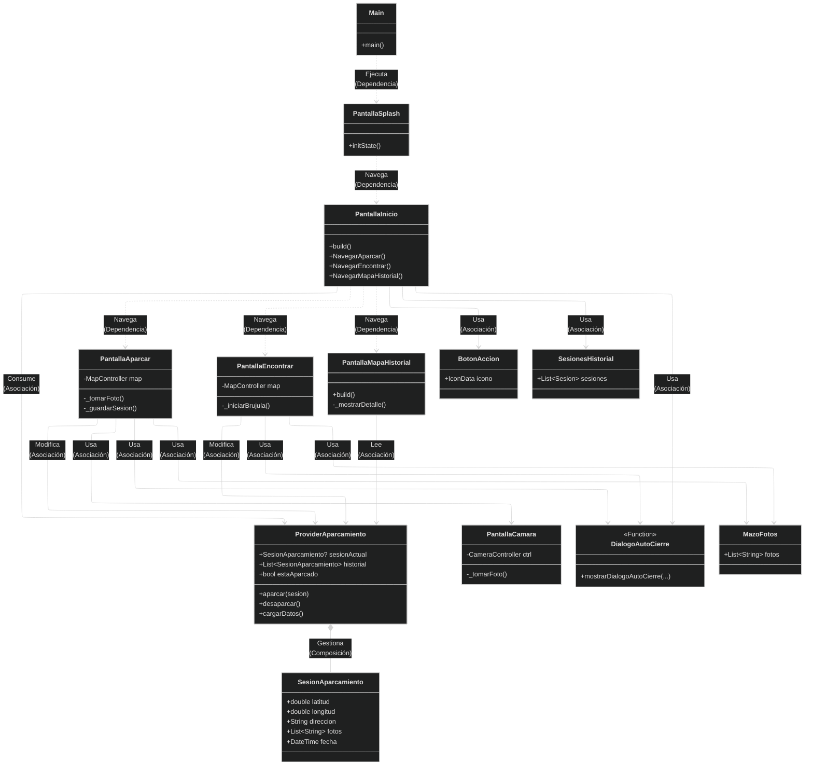

# Diagrama de Clases

```mermaid
---
config:
  layout: elk
  theme: dark
---
classDiagram
    direction TB

    %% --- LOGICA Y DATOS ---
    class Main {
        +main()
    }

    class SesionAparcamiento {
        +double latitud
        +double longitud
        +String direccion
        +List~String~ fotos
        +DateTime fecha
    }

    class ProviderAparcamiento {
        +SesionAparcamiento? sesionActual
        +List~SesionAparcamiento~ historial
        +bool estaAparcado
        +aparcar(sesion)
        +desaparcar()
        +cargarDatos()
    }

    %% --- PANTALLAS ---
    class PantallaSplash {
        +initState()
    }

    class PantallaInicio {
        +build()
        +NavegarAparcar()
        +NavegarEncontrar()
        +NavegarMapaHistorial()
    }

    class PantallaAparcar {
        -MapController map
        -_tomarFoto()
        -_guardarSesion()
    }

    class PantallaEncontrar {
        -MapController map
        -_iniciarBrujula()
    }

    class PantallaMapaHistorial {
        +build()
        -_mostrarDetalle()
    }

    class PantallaCamara {
        -CameraController ctrl
        -_tomarFoto()
    }

    %% --- WIDGETS ---
    class BotonAccion {
        +IconData icono
    }

    class DialogoAutoCierre {
        <<Function>>
        +mostrarDialogoAutoCierre(...)
    }

    class MazoFotos {
        +List~String~ fotos
    }

    class SesionesHistorial {
        +List~Sesion~ sesiones
    }

    %% --- RELACIONES ---

    %% Composición (Rombo Relleno)
    ProviderAparcamiento *-- SesionAparcamiento : Gestiona<br/>(Composición)

    %% Dependencia (Navegación - Punteada)
    Main ..> PantallaSplash : Ejecuta<br/>(Dependencia)
    PantallaSplash ..> PantallaInicio : Navega<br/>(Dependencia)

    PantallaInicio ..> PantallaAparcar : Navega<br/>(Dependencia)
    PantallaInicio ..> PantallaEncontrar : Navega<br/>(Dependencia)
    PantallaInicio ..> PantallaMapaHistorial : Navega<br/>(Dependencia)

    %% Asociación (Uso - Continua)
    PantallaAparcar --> PantallaCamara : Usa<br/>(Asociación)

    PantallaInicio --> ProviderAparcamiento : Consume<br/>(Asociación)
    PantallaAparcar --> ProviderAparcamiento : Modifica<br/>(Asociación)
    PantallaEncontrar --> ProviderAparcamiento : Modifica<br/>(Asociación)
    PantallaMapaHistorial --> ProviderAparcamiento : Lee<br/>(Asociación)

    PantallaInicio --> BotonAccion : Usa<br/>(Asociación)
    PantallaInicio --> SesionesHistorial : Usa<br/>(Asociación)

    PantallaAparcar --> MazoFotos : Usa<br/>(Asociación)
    PantallaEncontrar --> MazoFotos : Usa<br/>(Asociación)

    PantallaAparcar --> DialogoAutoCierre : Usa<br/>(Asociación)
    PantallaEncontrar --> DialogoAutoCierre : Usa<br/>(Asociación)
    PantallaInicio --> DialogoAutoCierre : Usa<br/>(Asociación)
```
