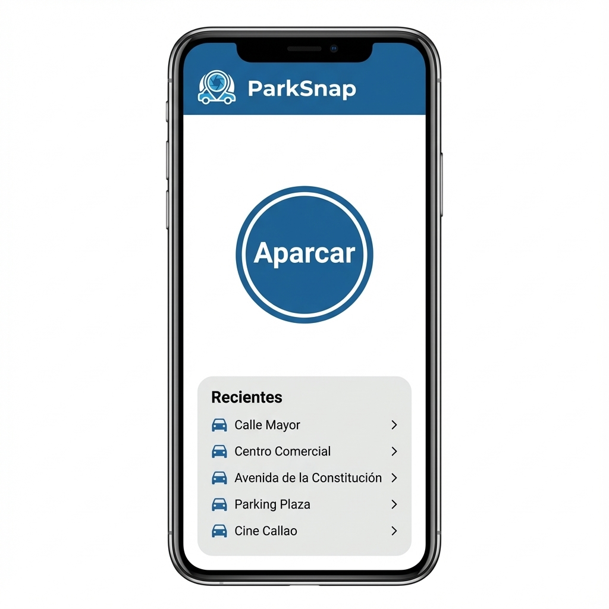
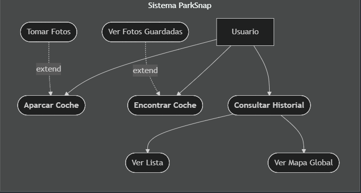
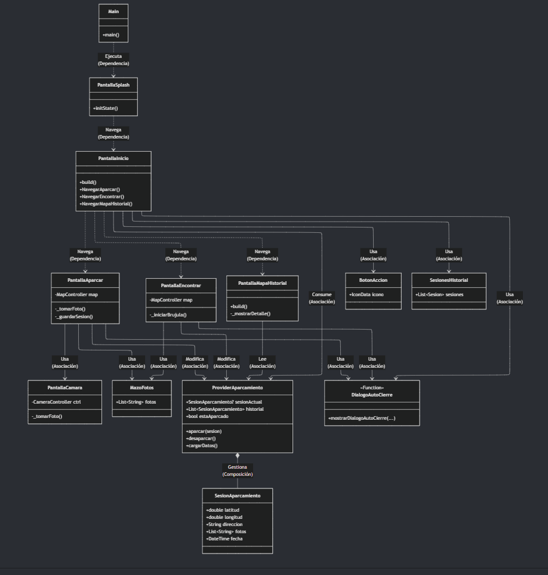
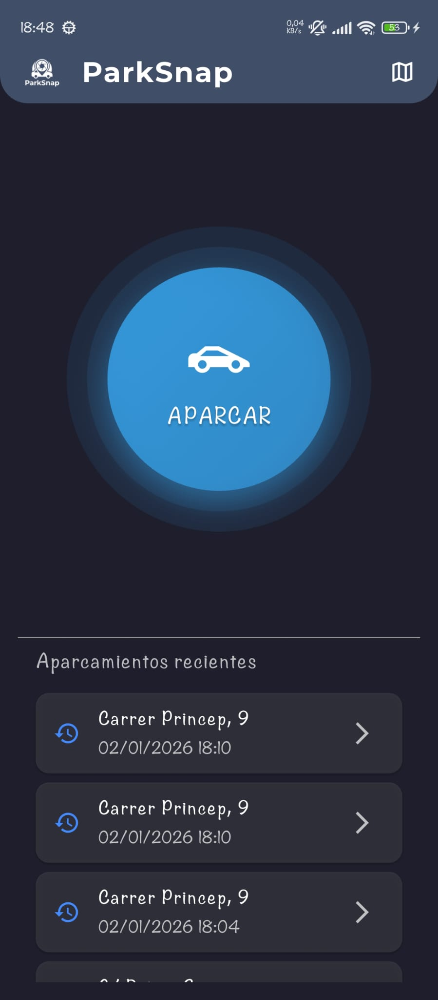
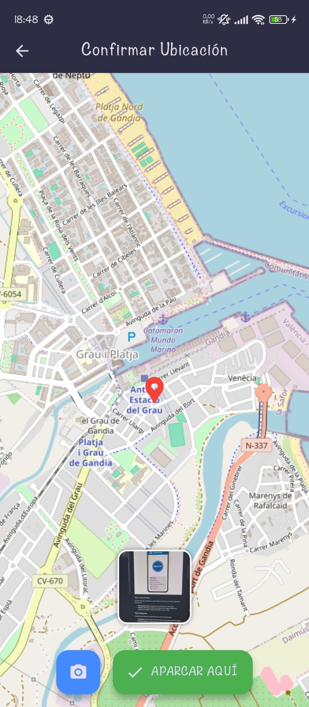
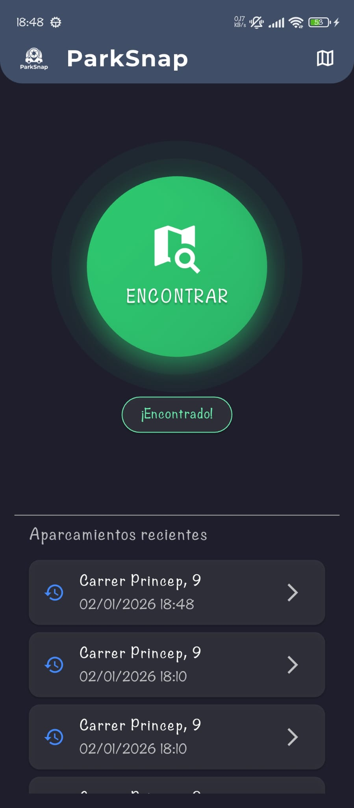
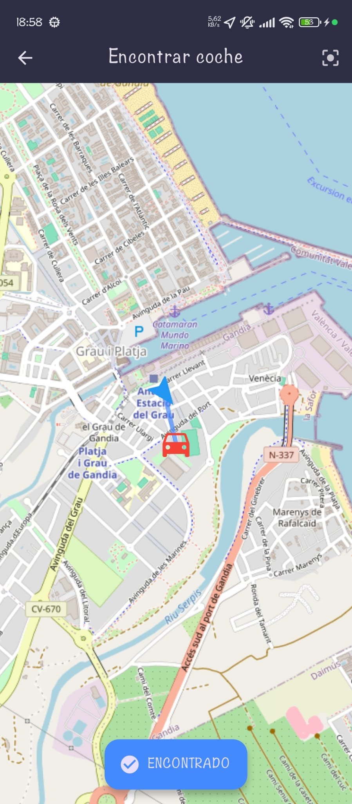
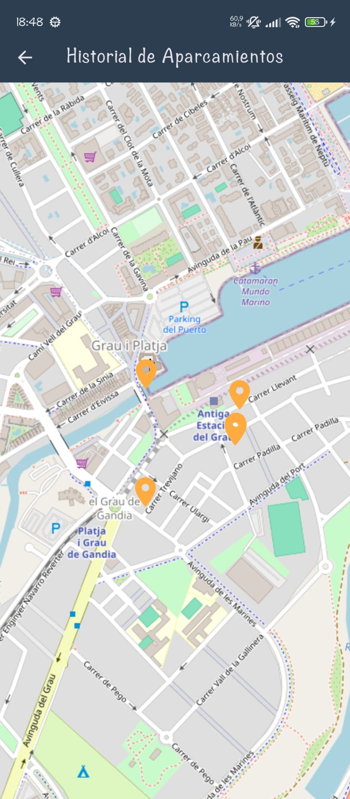

# Memoria del Proyecto - ParkSnap 🚗

## 1. Descripción del Proyecto

**ParkSnap** es una aplicación diseñada para resolver la problemática habitual de olvidar la ubicación exacta donde se ha estacionado el vehículo. El sistema permite registrar la geolocalización exacta y añadir referencias visuales mediante fotografías para facilitar la posterior recuperación del vehículo.

Este proyecto ha sido desarrollado con el objetivo de consolidar y demostrar los conocimientos adquiridos en la **Práctica 5.2**, integrando las siguientes tecnologías clave:

- **Geolocalización y Mapas:** Implementación de `geolocator` para la obtención precisa de coordenadas y `flutter_map` para su visualización interactiva. Además, se incluye `geocoding` para convertir las coordenadas en direcciones postales legibles.
- **Gestión de Cámara:** Uso del hardware del dispositivo para la captura de referencias visuales del entorno.
- **Persistencia de Datos:** Sistema de almacenamiento local para garantizar que la información de la sesión se mantenga disponible incluso si la aplicación se cierra.
- **Arquitectura Provider:** Implementación del patrón Provider para una gestión eficiente y desacoplada del estado de la aplicación.
- **Uso de Sensores:** Como mejora sobre la versión base, se ha implementado en última instancia la orientación por brújula en el mapa, cumpliendo con el requisito de uso de sensores del dispositivo.

## 2. Diseño y Funcionalidad

El diseño de la interfaz se ha priorizado para ser funcional y directo, evitando menús complejos y permitiendo al usuario realizar la acción principal en el menor número de pasos posible.

### Pantalla de Carga (Splash Screen)

Al iniciar la aplicación, se presenta una pantalla de bienvenida simple mientras el sistema realiza las comprobaciones iniciales (permisos de GPS y carga de datos persistentes).

### Pantalla Principal

Esta pantalla actúa como el centro de control y mantiene una estructura constante con elementos dinámicos:

**Elementos Fijos:**

- **Panel de Recientes:** En la zona inferior, lista el historial de ubicaciones. **Interacción:** Cada elemento es "clicable" y permite reabrir el mapa visualizando esa ubicación antigua (modo solo lectura), facilitando recordar dónde se aparcó en días anteriores.

**Navegación:**
Todas las pantallas secundarias (Mapas, Cámara) incluyen una barra superior (**AppBar**) con un botón de retorno evidente para garantizar una navegación fluida hacia la pantalla principal.

<div style="page-break-before:always">&nbsp;</div>

**Área Dinámica (Central):**
Esta zona central cambia completamente según el estado del aparcamiento:

1.  **Estado "Sin Aparcar":**

    - Se muestra de forma destacada y única el botón **"Aparcar Coche"**.

2.  **Estado "Aparcado":**
    - **Banner de Estado:** Aparece un indicador visual claro (Banner o Tarjeta) con el texto "¡COCHE APARCADO!".
    - **Botón de Acción:** El botón principal cambia a **"Encontrar Coche"**.
    - **Info:** Se muestran los detalles de la hora de entrada y la dirección.
    - **Acción Rápida:** Aparece el botón "Liberar Plaza" para borrar el registro rápidamente.

- Mockup preliminar:



### Flujo de Aparcamiento

Al iniciar el proceso de aparcar, el usuario valida su ubicación en el mapa y dispone de dos opciones:

- **Solo Aparcar:** Registra únicamente las coordenadas y la hora actual.
- **Aparcar y Foto:** Activa la cámara para capturar una imagen de referencia, guardando un registro completo (Ubicación + Hora + Foto).

### Flujo de Búsqueda

El proceso para recuperar el vehículo sigue una secuencia estructurada:

1.  **Iniciación:** El usuario pulsa el botón "Encontrar Coche" desde la pantalla principal.
2.  **Carga del Mapa:** Se despliega la vista de mapa, ajustando el zoom automáticamente para mostrar tanto la posición actual del usuario (GPS) como la ubicación guardada del coche.
3.  **Visualización:** Se traza una referencia visual entre ambos puntos.
4.  **Referencia Fotográfica:** Si se guardaron imágenes, estas aparecen como una **pila de tarjetas flotante** con efecto de relieve visible en el mapa. Al pulsar sobre el conjunto, se despliegan todas las fotos capturadas en una galería deslizable para examinar las referencias en detalle.

## 3. Análisis Funcional (Casos de Uso)

Para formalizar las interacciones del usuario con el sistema, se ha definido el siguiente diagrama de casos de uso que cubre la totalidad de las funcionalidades de ParkSnap.



<div style="page-break-before:always">&nbsp;</div>

## 4. Arquitectura Técnica

El código fuente se ha estructurado siguiendo una organización modular y semántica, utilizando nomenclatura en español para facilitar la legibilidad.

```
lib/
├── main.dart                  # Punto de entrada
├── modelos/
│   └── sesion_aparcamiento.dart
├── provider/
│   └── provider_aparcamiento.dart
├── pantallas/
│   ├── pant_splash.dart
│   ├── pant_inicio.dart
│   ├── pant_aparcar.dart
│   ├── pant_encontrar.dart
│   ├── pant_camara.dart
│   └── pant_mapa_historial.dart
└── widgets/
    ├── boton_accion.dart
    ├── dialogo_auto_cierre.dart
    ├── mazo_fotos.dart
    └── sesiones_historial.dart
```

<div style="page-break-before:always">&nbsp;</div>

### Diagrama de Clases

He elaborado este diagrama detallado para definir la estructura de las clases, sus atributos, métodos específicos para la construcción de la UI (`_build...`) y las relaciones entre compontentes.



<div style="page-break-before:always">&nbsp;</div>

## 5. Plan de Trabajo

Para abordar el desarrollo de forma ordenada, he establecido la siguiente hoja de ruta:

1.  **Configuración Inicial:** Creación del proyecto Flutter e instalación de dependencias en `pubspec.yaml`.
2.  **Estructura de Directorios:** Organización de las carpetas según la arquitectura definida.
3.  **Lógica y Datos:** Implementación de la clase `SesionAparcamiento` y del `ProveedorAparcamiento`. El objetivo inicial es asegurar que la persistencia y la gestión de estado funcionan correctamente con datos de prueba.
4.  **Interfaz Base:** Desarrollo de las pantallas principales `PantallaInicio`, `PantallaAparcar`, `PantallaEncontrar` y su vinculación con el Provider para verificar los cambios de estado.
5.  **Pruebas de Geolocalización:** Implementación del mapa y verificación de la obtención de coordenadas en tiempo real.
6.  **Integración de Cámara:** Conexión con el hardware del dispositivo para la captura y almacenamiento de imágenes.
7.  **Pruebas Finales:** Validación del flujo completo de uso: Aparcar -> Foto -> Persistencia -> Visualización -> Liberación.

<div style="page-break-before:always">&nbsp;</div>

## 6. Mejoras y Refinamiento Final

Como fase final del desarrollo, he implementado una serie de mejoras visuales y funcionales para elevar la calidad de la experiencia de usuario (UX):

1.  **Mapa de Historial Interactivo:**
    He creado una nueva pantalla (`PantallaMapaHistorial`) accesible desde la barra superior. Esta vista permite visualizar todas las sesiones de aparcamiento pasadas como chinchetas en un mapa global, en lugar de solo verlas en una lista de texto. Al pulsar una chincheta, se muestra el detalle de esa sesión.

2.  **Orientación por Brújula:**
    Para facilitar la búsqueda del vehículo, he integrado el sensor de brújula del dispositivo (`flutter_compass`). Ahora, en el mapa de "Encontrar Coche", el icono del usuario es una flecha que rota en tiempo real según hacia donde apunte el móvil, ayudando a orientarse mejor hacia el destino.

3.  **Feedback Visual Mejorado:**
    He reemplazado las notificaciones simples (Snackbars) por **diálogos modales personalizados y auto-cerrables** (`DialogoAutoCierre`). Al completar una acción importante (Aparcar o Encontrar), aparece una tarjeta elegante en la parte superior con fondo traslúcido que confirma la acción y se cierra automáticamente tras 1.5 segundos, ofreciendo una interacción mucho más fluida y moderna.

4.  **Unificación de Diseño:**
    He estandarizado los botones y diálogos en toda la aplicación para mantener una coherencia visual, asegurando que todas las pantallas compartan el mismo lenguaje de diseño "ParkSnap".

<div style="page-break-before:always">&nbsp;</div>

## 7. Resultado Final (Capturas)

A continuación se muestra el flujo completo de uso de la aplicación:

|        **1. Pantalla de Carga**        |       **2. Inicio (Sin Aparcar)**       |
| :------------------------------------: | :-------------------------------------: |
|  |  |
|           Bienvenida y carga           |  Pantalla principal lista para aparcar  |

|         **3. Mapa: Confirmar Ubicación**          |       **4. Inicio (Estado Aparcado)**        |
| :-----------------------------------------------: | :------------------------------------------: |
|  |  |
|           Guardado de ubicación y foto            |     Estado actual y tiempo transcurrido      |

|            **5. Mapa: Búsqueda y Brújula**            |           **6. Historial Global**           |
| :---------------------------------------------------: | :-----------------------------------------: |
|  |  |
|              Ruta y orientación al coche              |      Visualización de sesiones pasadas      |
