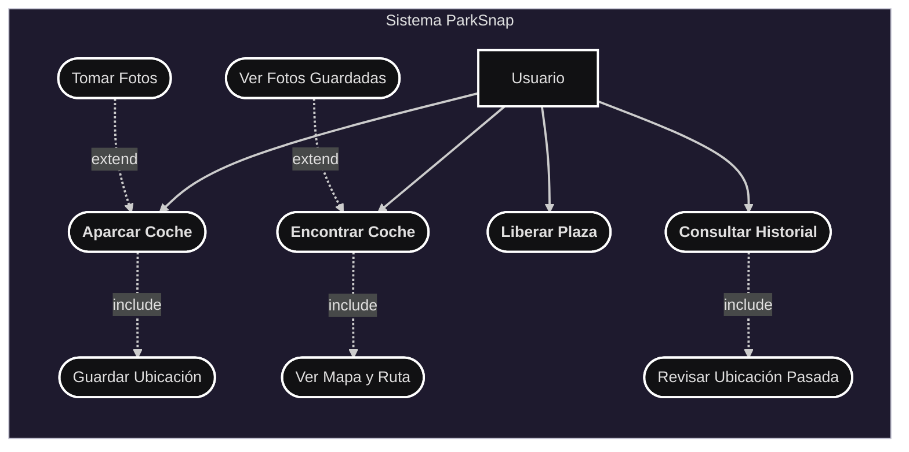
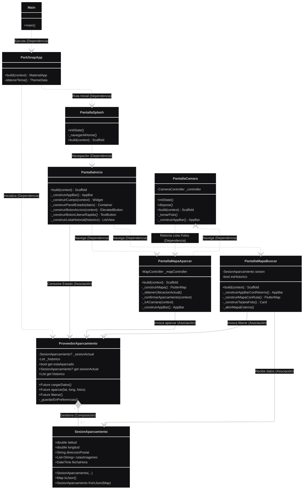

# Memoria del Proyecto - ParkSnap 🚗

## 1. Descripción del Proyecto

**ParkSnap** es una aplicación diseñada para resolver la problemática habitual de olvidar la ubicación exacta donde se ha estacionado el vehículo. El sistema permite registrar la geolocalización exacta y añadir referencias visuales mediante fotografías para facilitar la posterior recuperación del vehículo.

Este proyecto ha sido desarrollado con el objetivo de consolidar y demostrar los conocimientos adquiridos en la **Práctica 5.2**, integrando las siguientes tecnologías clave:

- **Geolocalización y Mapas:** Implementación de `geolocator` para la obtención precisa de coordenadas y `flutter_map` para su visualización interactiva. Además, se incluye `geocoding` para convertir las coordenadas en direcciones postales legibles.
- **Gestión de Cámara:** Uso del hardware del dispositivo para la captura de referencias visuales del entorno.
- **Persistencia de Datos:** Sistema de almacenamiento local para garantizar que la información de la sesión se mantenga disponible incluso si la aplicación se cierra.
- **Arquitectura Provider:** Implementación del patrón Provider para una gestión eficiente y desacoplada del estado de la aplicación.

## 2. Diseño y Funcionalidad

El diseño de la interfaz se ha priorizado para ser funcional y directo, evitando menús complejos y permitiendo al usuario realizar la acción principal en el menor número de pasos posible.

### Pantalla de Carga (Splash Screen)

Al iniciar la aplicación, se presenta una pantalla de bienvenida simple mientras el sistema realiza las comprobaciones iniciales (permisos de GPS y carga de datos persistentes).

### Pantalla Principal

Esta pantalla actúa como el centro de control y mantiene una estructura constante con elementos dinámicos:

**Elementos Fijos:**

- **Panel de Recientes:** En la zona inferior, lista el historial de ubicaciones. **Interacción:** Cada elemento es "clicable" y permite reabrir el mapa visualizando esa ubicación antigua (modo solo lectura), facilitando recordar dónde se aparcó en días anteriores.

**Navegación:**
Todas las pantallas secundarias (Mapas, Cámara) incluyen una barra superior (**AppBar**) con un botón de retorno evidente para garantizar una navegación fluida hacia la pantalla principal.

**Área Dinámica (Central):**
Esta zona central cambia completamente según el estado del aparcamiento:

1.  **Estado "Sin Aparcar":**

    - Se muestra de forma destacada y única el botón **"Aparcar Coche"**.

2.  **Estado "Aparcado":**
    - **Banner de Estado:** Aparece un indicador visual claro (Banner o Tarjeta) con el texto "¡COCHE APARCADO!".
    - **Botón de Acción:** El botón principal cambia a **"Encontrar Coche"**.
    - **Info:** Se muestran los detalles de la hora de entrada y la dirección.
    - **Acción Rápida:** Aparece el botón "Liberar Plaza" para borrar el registro rápidamente.


### Flujo de Aparcamiento

Al iniciar el proceso de aparcar, el usuario valida su ubicación en el mapa y dispone de dos opciones:

- **Solo Aparcar:** Registra únicamente las coordenadas y la hora actual.
- **Aparcar y Foto:** Activa la cámara para capturar una imagen de referencia, guardando un registro completo (Ubicación + Hora + Foto).

### Flujo de Búsqueda

El proceso para recuperar el vehículo sigue una secuencia estructurada:

1.  **Iniciación:** El usuario pulsa el botón "Encontrar Coche" desde la pantalla principal.
2.  **Carga del Mapa:** Se despliega la vista de mapa, ajustando el zoom automáticamente para mostrar tanto la posición actual del usuario (GPS) como la ubicación guardada del coche.
3.  **Visualización:** Se traza una referencia visual entre ambos puntos.
4.  **Referencia Fotográfica:** Si se guardaron imágenes, estas aparecen como una **pila de tarjetas flotante** con efecto de relieve visible en el mapa. Al pulsar sobre el conjunto, se despliegan todas las fotos capturadas en una galería deslizable para examinar las referencias en detalle.

## 3. Análisis Funcional (Casos de Uso)

Para formalizar las interacciones del usuario con el sistema, se ha definido el siguiente diagrama de casos de uso que cubre la totalidad de las funcionalidades de ParkSnap.


```mermaid
graph TD
    %%{init: {'theme': 'redux-dark'}}%%

    User["Usuario"]

    subgraph Sistema_ParkSnap [Sistema ParkSnap]
        direction TB

        %% --- Casos de Uso Principales (Nivel 1) ---
        UC_Aparcar(["<b>Aparcar Coche</b>"])
        UC_Encontrar(["<b>Encontrar Coche</b>"])
        UC_Liberar(["<b>Liberar Plaza</b>"])
        UC_Historial(["<b>Consultar Historial</b>"])

        %% --- Sub-Funciones / Detalles (Nivel 2) ---
        Detail_Guardar(["Guardar Ubicación"])
        Detail_Foto(["Tomar Fotos"])

        Detail_Mapa(["Ver Mapa y Ruta"])
        Detail_VerFoto(["Ver Fotos Guardadas"])

        Detail_Revisar(["Revisar Ubicación Pasada"])

        %% --- Relaciones del Actor ---
        User --> UC_Aparcar
        User --> UC_Encontrar
        User --> UC_Liberar
        User --> UC_Historial

        %% --- Relaciones Técnicas (Standard UML) ---

        %% Aparcar: Siempre guarda ubicación (Include). Puede tener foto (Extend).
        UC_Aparcar -.->|include| Detail_Guardar
        Detail_Foto -.->|extend| UC_Aparcar

        %% Encontrar: Siempre muestra mapa (Include). Puede ver fotos (Extend).
        %% Nota: Liberar Plaza es accesible aquí pero es un CU propio del usuario.
        UC_Encontrar -.->|include| Detail_Mapa
        Detail_VerFoto -.->|extend| UC_Encontrar

        %% Historial: Incluye ver el detalle
        UC_Historial -.->|include| Detail_Revisar
    end
```

## 4. Arquitectura Técnica

El código fuente se ha estructurado siguiendo una organización modular y semántica, utilizando nomenclatura en español para facilitar la legibilidad.

```
lib/
├── main.dart                  # Punto de entrada y configuración del tema
├── modelos/
│   └── sesion_aparcamiento.dart  # Definición de la estructura de datos
├── proveedores/
│   └── proveedor_aparcamiento.dart # Lógica de negocio y gestión de estado
└── pantallas/
    ├── pantalla_splash.dart
    ├── pantalla_inicio.dart
    ├── pantalla_mapa_aparcar.dart
    ├── pantalla_camara.dart
    └── pantalla_mapa_buscar.dart
```

### Diagrama de Clases

He elaborado este diagrama detallado para definir la estructura de las clases, sus atributos, métodos específicos para la construcción de la UI (`_build...`) y las relaciones entre compontentes.


```mermaid
---
config:
  layout: elk
  theme: redux-dark
---
classDiagram
    %% --- MAIN Y CONFIGURACIÓN ---
    class Main {
        +main()
    }
    class ParkSnapApp {
        +build(context) MaterialApp
        -obtenerTema() ThemeData
    }

    %% --- MODELO DE DATOS ---
    class SesionAparcamiento {
        +double latitud
        +double longitud
        +String direccionPostal
        +List~String~ rutasImagenes
        +DateTime fechaHora
        +SesionAparcamiento(...)
        +Map<String, dynamic> toJson()
        +SesionAparcamiento fromJson(Map)
    }

    %% --- LÓGICA DE NEGOCIO (PROVIDER) ---
    class ProveedorAparcamiento {
        -SesionAparcamiento? _sesionActual
        -List<SesionAparcamiento> _historico
        +bool get estaAparcado
        +SesionAparcamiento? get sesionActual
        +List<SesionAparcamiento> get historico
        +Future<void> cargarDatos()
        +Future<void> aparcar(lat, long, fotos)
        +Future<void> liberar()
        -_guardarEnPreferencias()
    }

    %% --- INTERFAZ DE USUARIO (SCREENS) ---

    %% Splash Screen
    class PantallaSplash {
        +initState()
        -_navegarAlHome()
        +build(context) Scaffold
    }

    %% Pantalla Principal (Home)
    class PantallaInicio {
        +build(context) Scaffold
        -_construirAppBar() AppBar
        -_construirCuerpo(context) Widget
        -_construirPanelEstado(datos) Container
        -_construirBotonAccion(context) ElevatedButton
        -_construirBotonLiberarRapido() TextButton
        -_construirListaHistorial(historico) ListView
    }

    %% Mapa de Aparcamiento
    class PantallaMapaAparcar {
        -MapController _mapController
        +build(context) Scaffold
        -_construirMapa() FlutterMap
        -_obtenerUbicacionActual()
        -_confirmarAparcamiento(context)
        -_irACamara(context)
        -_construirAppBar() AppBar
    }

    %% Interfaz de Cámara
    class PantallaCamara {
        -CameraController _controller
        +initState()
        +dispose()
        +build(context) Scaffold
        -_tomarFoto()
        -_construirAppBar() AppBar
    }

    %% Mapa de Búsqueda
    class PantallaMapaBuscar {
        -SesionAparcamiento sesion
        -bool esHistorico
        +build(context) Scaffold
        -_construirAppBarConRetorno() AppBar
        -_construirMapaConRuta() FlutterMap
        -_construirTarjetaFoto() Card
        -_abrirMapaExterno()
    }

    %% --- RELACIONES Y FLUJO ---

    %% Flujo de Ejecución
    Main ..> ParkSnapApp : Ejecuta (Dependencia)
    ParkSnapApp ..> PantallaSplash : Ruta Inicial (Dependencia)
    ParkSnapApp ..> ProveedorAparcamiento : Inicializa (Dependencia)

    %% Navegación
    PantallaSplash ..> PantallaInicio : Navegación (Dependencia)

    PantallaInicio --> ProveedorAparcamiento : Consume Estado (Asociación)
    PantallaInicio ..> PantallaMapaAparcar : Navega (Dependencia)
    PantallaInicio ..> PantallaMapaBuscar : Navega (Dependencia)

    PantallaMapaAparcar --> ProveedorAparcamiento : Invoca aparcar (Asociación)
    PantallaMapaAparcar ..> PantallaCamara : Navega (Dependencia)

    PantallaCamara ..> PantallaMapaAparcar : Retorna Lista Fotos (Dependencia)

    PantallaMapaBuscar --> SesionAparcamiento : Recibe datos (Asociación)
    PantallaMapaBuscar --> ProveedorAparcamiento : Invoca liberar (Asociación)

    %% Gestión de Datos (Cardinalidad Importante aquí)
    ProveedorAparcamiento "1" *-- "0..*" SesionAparcamiento : Gestiona (Composición)
```

## 5. Plan de Trabajo

Para abordar el desarrollo de forma ordenada, he establecido la siguiente hoja de ruta:

1.  **Configuración Inicial:** Creación del proyecto Flutter e instalación de dependencias en `pubspec.yaml`.
2.  **Estructura de Directorios:** Organización de las carpetas según la arquitectura definida.
3.  **Lógica y Datos:** Implementación de la clase `SesionAparcamiento` y del `ProveedorAparcamiento`. El objetivo inicial es asegurar que la persistencia y la gestión de estado funcionan correctamente con datos de prueba.
4.  **Interfaz Base:** Desarrollo de la `PantallaInicio` y su vinculación con el Provider para verificar los cambios de estado.
5.  **Pruebas de Geolocalización:** Implementación del mapa y verificación de la obtención de coordenadas en tiempo real.
6.  **Integración de Cámara:** Conexión con el hardware del dispositivo para la captura y almacenamiento de imágenes.
7.  **Pruebas Finales:** Validación del flujo completo de uso: Aparcar -> Foto -> Persistencia -> Visualización -> Liberación.
